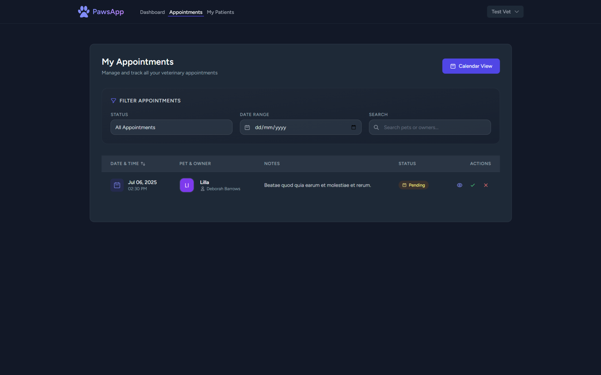
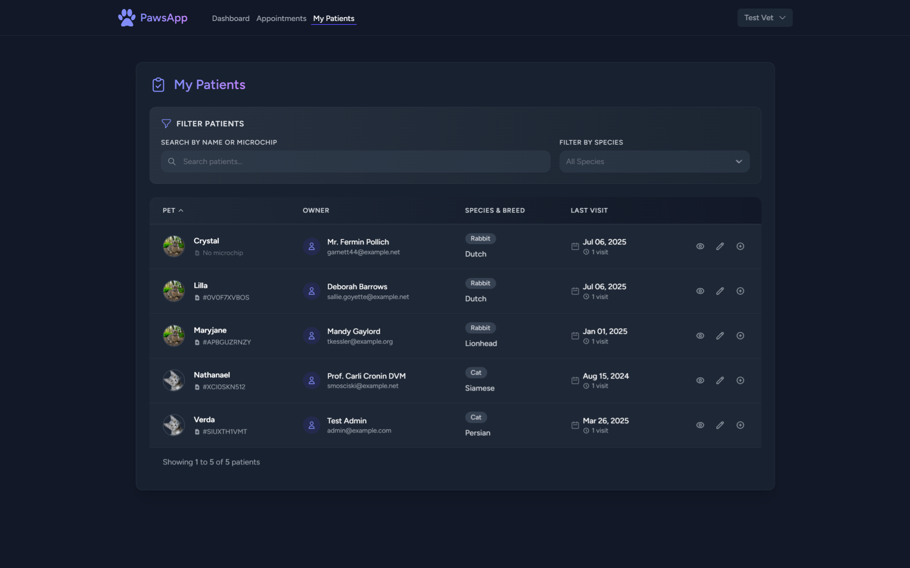
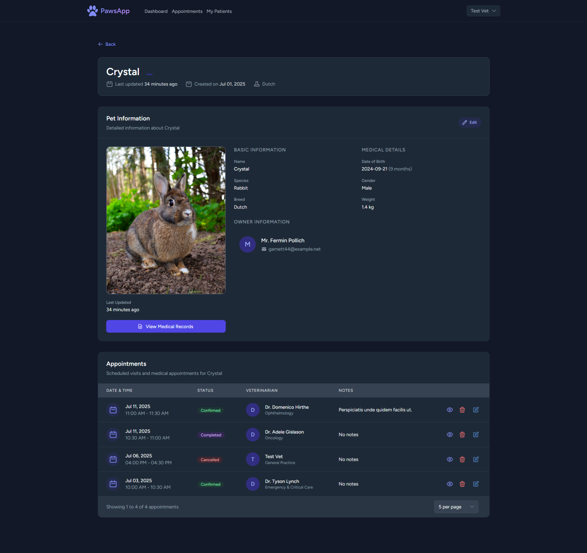
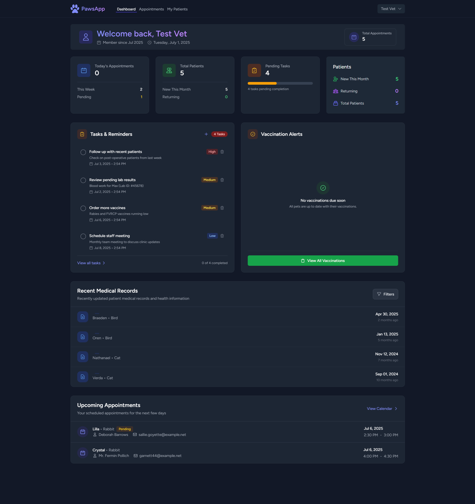
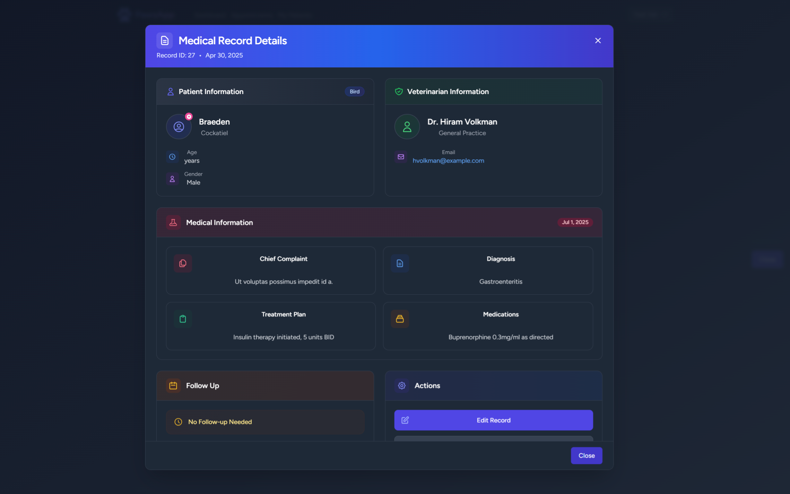
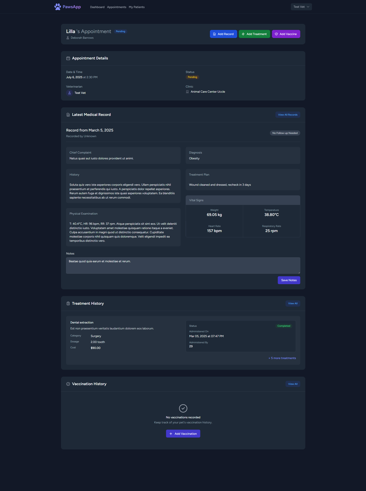

<div align="center">

# Veterinary Management System

_A comprehensive backend system for managing veterinary clinics, appointments, and pet health records_

[](https://laravel.com)
[](https://php.net)
[](https://laravel-livewire.com)

</div>

## 🚀 Features

-   **User Management**

    -   Role-based access control (Admin, Veterinarian, Client)
    -   Email verification
    -   Password reset functionality

-   **Pet Management**

    -   Comprehensive pet profiles
    -   Medical history tracking
    -   Vaccination records

-   **Appointment System**

    -   Online scheduling
    -   Calendar integration
    -   Reminder notifications

-   **Medical Records**

    -   Treatment history
    -   Prescription tracking
    -   Medical notes

-   **Clinic Management**
    -   Multi-location support
    -   Veterinarian schedules
    -   Resource allocation

## 🛠 Tech Stack

-   **Backend**: Laravel 12.x
-   **Frontend**: Laravel Livewire, Tailwind CSS
-   **Authentication**: Laravel Fortify with Sanctum
-   **Database**: MySQL/PostgreSQL
-   **API**: RESTful JSON API
-   **Testing**: PHPUnit

## 📦 Requirements

-   PHP 8.1 or higher
-   Composer
-   Node.js & NPM
-   MySQL 8.0+ / PostgreSQL 13+
-   Web server (Apache/Nginx)

## 🚀 Installation

1. **Clone the repository**

    ```bash
    git clone https://github.com/your-username/veterinary-management-system.git
    cd veterinary-management-system
    ```

2. **Install dependencies**

    ```bash
    composer install
    npm install
    ```

3. **Configure environment**

    ```bash
    cp .env.example .env
    php artisan key:generate
    ```

4. **Configure database**

    Update `.env` with your database credentials:

    ```env
    DB_CONNECTION=mysql
    DB_HOST=127.0.0.1
    DB_PORT=3306
    DB_DATABASE=your_database
    DB_USERNAME=your_username
    DB_PASSWORD=your_password
    ```

5. **Run migrations**

    ```bash
    php artisan migrate --seed
    ```

6. **Compile assets**

    ```bash
    npm run build
    ```

7. **Start the development server**

    ```bash
    php artisan serve
    ```

## 📸 Screenshots

Here are some screenshots of the application in action:

| Dashboard | Pet Management | Appointment Calendar | Medical Records | User Profile | Settings |
|-----------|----------------|----------------------|-----------------|--------------|----------|
|  |  |  |  |  |  |

_Click on any image to view it in full size._

## 🔐 API Documentation

API documentation is available at `/api/documentation` after setting up the application.

## 🧪 Testing

Run the test suite:

```bash
php artisan test
```

## License

The Laravel framework is open-sourced software licensed under the [MIT license](https://opensource.org/licenses/MIT).
